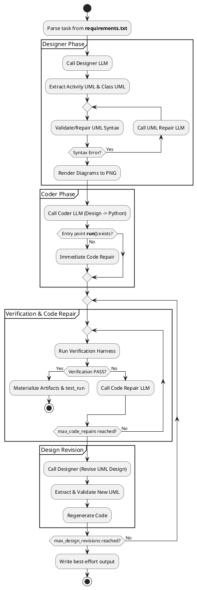
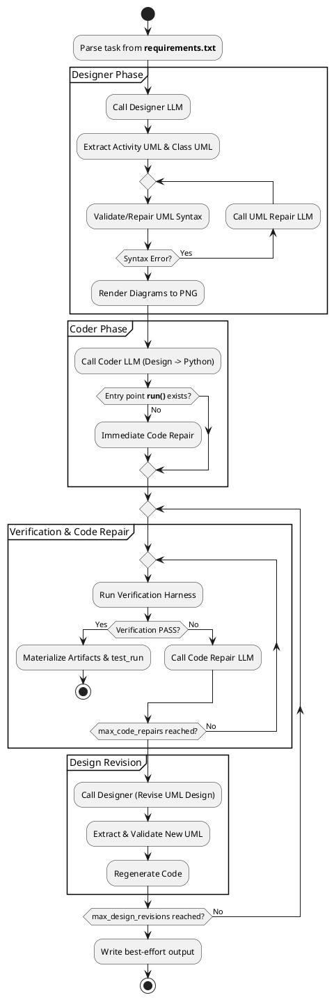

# StructGen Runner v2 (UML → Python with Verification)

StructGen Runner v2 is an automated **structured code generation** framework. It uses Large Language Models (LLMs) to transform natural language requirements into verified, production-ready scientific Python modules through a formal design-first approach.

The core philosophy of StructGen is that **design precedes code**. By forcing the LLM to create and validate PlantUML diagrams before writing a single line of Python, the runner ensures the model has a consistent mental model of the task's logic and data structures. This workflow utilizes [Activity Diagrams](https://www.uml-diagrams.org/activity-diagrams.html) to model the dynamic control flow and [Class Diagrams](https://www.uml-diagrams.org/class-diagrams-overview.html) to model the static structure of the solution. For more information, visit [UML-Diagrams.org](https://www.uml-diagrams.org/).

Complementing this is the **Verification Loop**: code is not considered "done" until it passes an automated suite of numerical and structural checks. If verification fails, the system enters an autonomous repair cycle—fixing the code or even revising the design—until the solution is proven correct.

---

## Requirement Packet Format

The `requirements.txt` file is the source of truth for your tasks. It is written in a semi-structured format that includes both natural language goals and machine-readable verification directives.

### Structure
*   **Multiple Tasks**: You can define multiple tasks in one file by separating them with a line containing only `---`.
*   **Sections**: Typically includes `TITLE`, `GOAL`, `ENTRY POINT`, and `INPUTS/OUTPUTS` to guide the LLM's understanding.
*   **Directives**: Machine-readable lines starting with `@` that drive the automated verification harness.

### Verification Directives Reference

## Verification DSL Reference

Directives are parsed from `requirements.txt`. Each must be on its own line starting with `@`.

### 1. Directives Table
| Directive | Purpose | Format | Notes / Examples |
| :--- | :--- | :--- | :--- |
| **`@input_file`** | Specifies the source CSV file. | `@input_file: data.csv` | Relative to the `requirements.txt`. |
| **`@output_file`** | The expected output filename. | `@output_file: result.csv` | Defaults to `output.csv`. |
| **`@params`** | Arguments passed to `run()`. | `@params: k=v, k2=v2` | Supports Python-style literals and booleans. |
| **`@output_schema`** | Required columns in the output. | `@output_schema: a, b, c` | Fails if columns are missing. |
| **`@check`** | A rule to validate the output CSV. | `@check: <expression>` | See functions/operators below. |

### 2. Supported `@check` Functions
These can be used on the LEFT or RIGHT side of a comparison:

| Function | Description |
| :--- | :--- |
| `mean(col)` | The arithmetic mean of a column. |
| `std(col)` | The sample standard deviation (ddof=1) of a column. |
| `min(col)` / `max(col)` | The minimum or maximum value in a column. |
| `rms(col)` | The Root-Mean-Square of a column: `sqrt(mean(x^2))`. |
| `unique(col)` | The number of unique values in a column. |
| `count()` | The total number of rows in the output CSV. |

### 3. Structural Checks (Direct-Action)
These functions are used as standalone checks (they don't use operators):

*   **`columns(col1, col2, ...)`**: Verifies that all listed columns exist.
*   **`finite(col1, col2, ...)`**: Verifies that no value in the listed columns is `NaN` or `Inf`.

### 4. Comparison Operators & Tolerance
The runner supports standard comparisons: `==`, `!=`, `<`, `>`, `<=`, `>=`, and the **approximate** operator `~=`.

**Numeric Tolerance Keywords**:
You can add tolerances to the end of any comparison line:
*   `abs_tol=<val>`: Absolute tolerance.
*   `rel_tol=<val>`: Relative tolerance.

**Example**:
`@check: mean(y) ~= 10.0 abs_tol=0.1`  
*(Ensures the mean of 'y' is between 9.9 and 10.1)*

---

## Example Directive Block
```text
@input_file: sensor_data.csv
@output_file: denoised.csv
@params: window_size=5, method="linear"
@output_schema: timestamp, value_raw, value_clean
@check: columns(timestamp, value_clean)
@check: finite(value_clean)
@check: count() > 10
@check: rms(value_clean) <= rms(value_raw) rel_tol=1e-12
```
**Explanation**: This contract tells the runner to:
1.  Load `sensor_data.csv` as input.
2.  Execute `run(..., window_size=5, method="linear")`.
3.  **Structural**: Ensure `timestamp` and `value_clean` exist and `value_clean` has no missing values.
4.  **Count**: Verify the output contains more than 10 rows.
5.  **Numerical**: Ensure the Root-Mean-Square (RMS) of the cleaned data is less than or equal to the raw data (within a tiny numerical tolerance).

---

## Installation

### 1. Clone the repository
```bash
git clone https://github.com/thomasschrefl/structgen_runner.git
cd structgen_runner
```

### 2. Create the environment
The recommended way is to use **micromamba** (or conda/mamba) with the provided `environment.yml`:
```bash
micromamba create -f environment.yml
micromamba activate structgen-v2
```

### 3. PlantUML (Optional for PNG rendering)
Rendering diagrams to PNG requires **Java** and the `plantuml.jar` file.
- Java is included in the `environment.yml` (via `openjdk`).
- Download `plantuml.jar` and place it in your `run_dir_api` or `run_dir_cli` folders.

---

## Execution Modes

The runner supports two primary ways to interact with LLMs, organized into dedicated directories:

### 1. API Mode (`run_dir_api`)
Uses an OpenAI-compatible web API (local or cloud).
- **Best for**: `llama-server`, `vLLM`, `Ollama`, or OpenAI/Anthropic proxies.
- **Run**:
  ```bash
  cd run_dir_api
  micromamba run -n structgen-v2 python structgen_run_v2.py
  ```

### 2. CLI Mode (`run_dir_cli`)
Invokes a local command-line tool.
- **Best for**: Tools like `gemini-cli`, `claude-code`, or custom shell scripts.
- **Run**:
  ```bash
  cd run_dir_cli
  micromamba run -n structgen-v2 python structgen_run_v2.py
  ```

---

## Example Library

The `examples/` directory contains reference tasks and test data. To use an example:

1.  **Choose a directory**: Decide if you want to use `run_dir_api` or `run_dir_cli`.
2.  **Copy Requirements**: Copy the specific `requirements_XX.txt` file to `requirements.txt` inside your chosen run directory.
3.  **Copy Input Data**: Copy the corresponding `input_XX.csv` file into the same run directory.

### Example Reference Table

| Example | Task | Key Directives |
| :--- | :--- | :--- |
| **01: Sensor Denoising** | Rolling median + moving average filters. | `@params: window_size=5`, `@check: rms(value_denoised) <= rms(value_raw)` |
| **02: Poly Fit** | Fits a polynomial regression of degree `N`. | `@params: degree=2`, `@check: rms(residual) < 2.0` |
| **03: Irregular Resampling** | Linear interpolation to a regular grid. | `@params: dt=0.5`, `@check: finite(v_interp)` |
| **04: Group Aggregation** | Categorical grouping and z-score normalization. | `@output_schema: group,measurement,group_mean,group_std,z` |

---

## The Generation Sequence

The runner follows a hierarchical recovery process to ensure success even if the first attempt fails.

### Sequence Overview (Activity Diagram)



<details>
<summary>View PlantUML Source</summary>


</details>

### 1. Designer Phase
The LLM generates a complete technical design (Activity, Class, Architecture, Contract). The runner uses a **UML Repair Loop** to ensure the diagrams are syntactically valid PlantUML before the coder ever sees them.

### 2. Coder Phase
The LLM implements the design. The runner performs a fast AST check to ensure the mandatory `run(input_path, output_path, **params)` entry point exists. If missing, it triggers an immediate targeted repair.

### 3. Verification & Code Repair (Inner Loop)
The code is executed against the **Verification DSL**. If a check fails, the **Code Repair** loop begins. The LLM receives the **Full Traceback** and the **Capture I/O** (stdout/stderr) to diagnose and fix the specific bug.

### 4. Design Revision (Outer Loop)
If the code cannot be fixed after `max_code_repairs` (e.g., due to a fundamental logic flaw in the design), the runner triggers a **Design Revision**. The Designer is given the failure reports and asked to redraw the diagrams, which then restarts the implementation cycle.

---

## Configuration (`structgen_config.json`)

The runner behavior is controlled by a JSON configuration file.

### Interface Selection
| Parameter | Description |
| :--- | :--- |
| **`llm_provider`** | Choose between `"openai"` (API-based) or `"cli"` (Command-line based). |
| **`cli_command_template`** | *(CLI only)* The shell command to run. Supports `{system}`, `{user}`, and `{model}` placeholders. |
| **`base_url`** | *(API only)* The endpoint URL (e.g., `http://localhost:8080/v1`). |
| **`api_key`** | *(API only)* Your API key (use `sk-no-key-required` for local servers). |

### LLM Sampling & Control
| Parameter | API Mode (`openai`) | CLI Mode (`cli`) |
| :--- | :--- | :--- |
| **`model`** | Sent to the API. | Injected into `{model}` placeholder. |
| **`temperature`** | Controls creativity. | **Ignored** (set via CLI tool flags). |
| **`top_p`** | Controls diversity. | **Ignored**. |
| **`max_tokens`** | Caps response length. | **Ignored**. |

### Pipeline & Retry Limits (Both Modes)
| Parameter | Description |
| :--- | :--- |
| **`max_code_repairs`** | Number of attempts to fix Python code after verification failure. |
| **`max_design_revisions`** | Number of times to rethink the UML design if code repair fails. |
| **`max_uml_repairs`** | Number of attempts to fix PlantUML syntax errors. |
| **`plantuml_jar_path`** | Path to the `plantuml.jar` executable. |

### Advanced Settings (Both Modes)
*   **`prompt_token_budget`**: Threshold for automatic prompt compression to save context.
*   **`log_prompts`**: If `true`, saves all prompts to `out/<task>/prompts_used/` for debugging.
*   **`fail_on_error_output`**: Fails verification if the code prints `"Error:"` to stderr/stdout.

---

## Using Local LLMs with Ollama

You can use API mode with [Ollama](https://ollama.com/) by utilizing its OpenAI-compatible endpoint.

1.  **Configure Ollama**: Ensure Ollama is running (`ollama serve`).
2.  **Update `structgen_config.json`**:
    ```json
    {
      "llm_provider": "openai",
      "base_url": "http://localhost:11434/v1",
      "api_key": "ollama",
      "model": "qwen2.5-coder:32b"
    }
    ```

---

## Prerequisites

- **Python 3.10+** (Numpy & Pandas required)
- **Java (OpenJDK)** (for PlantUML)
- **Micromamba** (recommended environment manager)
